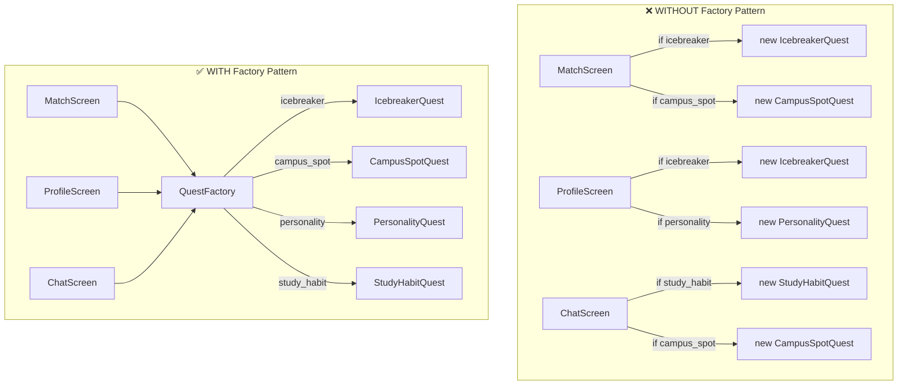
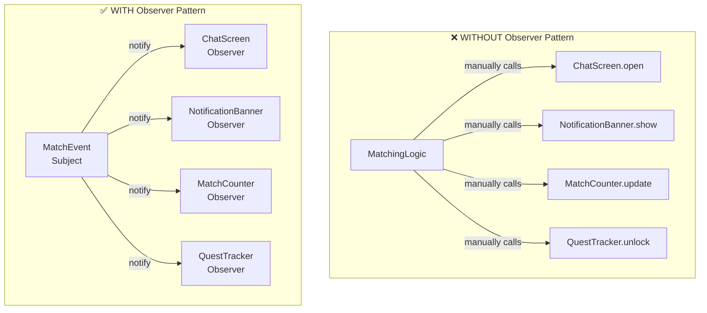

# UPV Dating App with a Twist: Design Pattern Implementation

## Table of Contents

- [A. App Summary](#a-app-summary)
- [B. Design Pattern Implementation](#b-design-pattern-implementation)
  - [Pattern 1: Creational - Factory Pattern](#pattern-1-creational---factory-pattern)
    - [i. Name of Pattern](#i-name-of-pattern)
    - [ii. Concept](#ii-concept)
    - [iii. Visual Diagram](#iii-visual-diagram)
    - [iv. Why it Works Nga](#iv-why-it-works-nga)
    - [v. Pseudocode](#v-pseudocode)
  - [Pattern 2: Behavioral - Observer Pattern](#pattern-2-behavioral---observer-pattern)
    - [i. Name of Pattern](#i-name-of-pattern-1)
    - [ii. Concept](#ii-concept-1)
    - [iii. Visual Diagram](#iii-visual-diagram-1)
    - [iv. Why it Works](#iv-why-it-works-nga-1)
    - [v. Pseudocode](#v-pseudocode-1)
  - [Pattern 3: Structural - Adapter Pattern](#pattern-3-structural---adapter-pattern)
    - [i. Name of Pattern](#i-name-of-pattern-2)
    - [ii. Concept](#ii-concept-2)
    - [iii. Visual Diagram](#iii-visual-diagram-2)
    - [iv. Why it Works](#iv-why-it-works-nga-2)
    - [v. Pseudocode](#v-pseudocode-2)
- [C. Initial Pattern Summary](#c-initial-pattern-summary)
- [D. Final Notes](#d-final-notes)

---

# A. App Summary

## App Name

**IskoMatch**

## App Idea

**IskoMatch** is a UPV dating app designed for students who want to meet potential matches through personality, shared campus experiences, and student-life interests rather than just profile pictures.

The app lets users create a student dating profile containing basic information such as:

- Name or nickname
- Course and year level
- Interests
- Favorite UPV spots
- Study habits
- Personality preferences
- Type of connection they are looking for

The app then suggests possible matches based on compatibility, shared interests, and campus-related preferences.

---

## The Twist: Mystery Match Quest

The unique twist of **IskoMatch** is called **Mystery Match Quest**.

Instead of showing the full profile immediately, the app slowly reveals profile details through short campus-themed quests. This makes the matching experience more fun, less appearance-based, and more connected to UPV student life. 

For example, instead of immediately showing the user’s full name and photo, the app may first show a clue like:
```text
A CMSC student who likes beach sunsets, quiet study sessions, and spontaneous food trips after class.
```
## B. Design Pattern Implementation
## Pattern 1: Creational - Factory Pattern

### i. Name of Pattern
Creational – Factory Pattern

---

### ii. Concept

The Factory Pattern is a creational design pattern na ginagmait kung the app needs to create different types of related objects, pero we do not want the object creation logic to be kalat everywhere.

Parang may isang "factory" sa app na responsible for creating objects. Instead of every screen saying, "If this is an icebreaker, create this. If this is a campus quest, create that," the screen just asks the factory: "Please create the quest I need."

This is usually used when there are many possible object types, but they belong to the same family or category. In IskoMatch, it is applied to the **Mystery Match Quest** feature because the app needs to create different types of quests:

- IcebreakerQuest
- CampusSpotQuest
- PersonalityQuest
- StudyHabitQuest

Instead of creating these manually in different screens, the app uses a **QuestFactory**.

---

### iii. Visual Diagram



---

### iv. Why it Works Nga

**Without Factory Pattern**

Without the Factory Pattern, bawat screen na kailangan gumawa ng quest may sariling logic. So for example, the Match Screen, Profile Screen, and Chat Screen might all have paulit-ulit na if-else statements just to decide which quest object ang gagawin.

Problematic siya because:
- Paulit-ulit yung creation logic.
- Mas mahirap i-maintain.
- If may bagong quest type, maraming files ang kailangan baguhin.
- May chance na inconsistent ang paggawa ng quest per screen.
- Nagiging messy yung code kasi the screens are doing too much.

For example, if the team adds a new `OrgLifeQuest`, kailangan i-update lahat ng screens na may quest creation logic.

| ❌ Without Factory Pattern | ✅ With Factory Pattern |
|---|---|
| Scattered creation logic across screens | Centralized creation in QuestFactory |
| Repeated if-else in every screen | Screens just call `QuestFactory.createQuest(type)` |
| Must update many files for new quest types | Only factory needs updating for new types |
| Risk of inconsistent quest creation | Consistent quest creation guaranteed |
| Screens are doing too much | Screens stay focused on their own logic |

**With Factory Pattern**

With the Factory Pattern, mas clean siya because may isang `QuestFactory` lang na bahala gumawa ng quest objects. The screen only needs to call:
QuestFactory.createQuest(type)

Mas okay ito because:
- Isang place lang ang responsible for creating quests.
- Hindi na kailangan malaman ng screen paano ginagawa yung bawat quest.
- If may bagong quest type, update lang sa factory.
- Mas organized and easier to extend.
- Mas mababa ang chance of repeated or inconsistent code.

Basically, the Factory Pattern works here because Mystery Match Quest has different quest types, and those quest types should be created in a **centralized and consistent** way.

---

### v. Pseudocode
``` code
CLASS IcebreakerQuest:
FUNCTION start():
RETURN "Answer a fun icebreaker question."
CLASS CampusSpotQuest:
FUNCTION start():
RETURN "Choose your favorite UPV campus spot."
CLASS PersonalityQuest:
FUNCTION start():
RETURN "Answer a personality-based prompt."
CLASS StudyHabitQuest:
FUNCTION start():
RETURN "Compare your study habits with your match."
CLASS QuestFactory:
FUNCTION createQuest(type):
IF type == "icebreaker":
RETURN new IcebreakerQuest()
ELSE IF type == "campus_spot":
RETURN new CampusSpotQuest()
ELSE IF type == "personality":
RETURN new PersonalityQuest()
ELSE IF type == "study_habit":
RETURN new StudyHabitQuest()
ELSE:
RETURN error "Unknown quest type"

MAIN PROGRAM:
selectedQuestType = "campus_spot"
quest = QuestFactory.createQuest(selectedQuestType)
DISPLAY quest.start()
```
---

Here's the complete Observer Pattern section in the same format as your document:

---

## Pattern 2: Behavioral – Observer Pattern

### i. Name of Pattern
Behavioral – Observer Pattern

---

### ii. Concept

The Observer Pattern is a behavioral design pattern na ginagamit kung kailangan ng isang object (ang **Subject**) na automatic na mag-notify ng maraming objects (ang mga **Observer**) tuwing nagbabago ang state niya — without the subject needing to know exactly who is listening.

Parang subscription system — yung mga nag-subscribe lang ang makakatanggap ng update. In **IskoMatch**, this is applied to the **match notification system**. When two users get matched, multiple parts of the app need to react simultaneously:

- The **Chat Screen** opens a new conversation
- The **Notification Banner** alerts both users
- The **Match Counter** updates on the profile
- The **Quest Tracker** unlocks the next Mystery Match Quest

Instead of the matching logic calling each of these manually, the app uses a `MatchEvent` as the subject, and each component registers itself as an observer.

---

### iii. Visual Diagram



---

### iv. Why it Works

**Without Observer Pattern**

Without the Observer Pattern, the matching logic has to manually call each component that needs to react to a new match. Bawat bagong component na idadagdag, kailangan pa i-edit ang matching logic mismo.

Problematic siya because:
- Tightly coupled ang matching logic sa bawat screen/component.
- Kapag nag-add ng bagong observer (like a `QuestTracker`), kailangan i-update ang core matching logic.
- Mas mahirap mag-test ng matching logic separately.
- Mas matagal mag-debug kapag isang component lang dapat mag-react pero all of them are being called.
- The matching logic is doing too much — it should only care about *whether* a match happened, not *what* happens next.

| ❌ Without Observer Pattern | ✅ With Observer Pattern |
|---|---|
| Matching logic manually calls every screen | Matching logic just fires `notify()` |
| Tight coupling between logic and UI | Loose coupling — observers register themselves |
| Adding a new feature = editing matching code | Adding a new feature = create new observer |
| Hard to test matching logic in isolation | Subject and observers are independently testable |
| One change can break multiple components | Components react independently |

**With Observer Pattern**

With the Observer Pattern, the `MatchEvent` subject lang ang responsible for broadcasting that a match happened. Each component subscribes to this event and handles its own reaction.

Mas okay ito because:
- The matching logic does not need to know about ChatScreen, Notifications, or Quests.
- Bagong feature? Gawa lang ng bagong Observer at i-subscribe — wala nang iba pang babaguhin.
- Mas modular, mas maintainable, mas testable.
- Components can even subscribe and unsubscribe dynamically (e.g., if the chat screen is not yet loaded).

Basically, the Observer Pattern works here because a match event triggers **multiple independent reactions**, and those reactions should be **decoupled from the event source**.

---

### v. Pseudocode

```
INTERFACE Observer:
  FUNCTION onMatchFound(matchData)

CLASS ChatScreen IMPLEMENTS Observer:
  FUNCTION onMatchFound(matchData):
    DISPLAY "Opening chat with " + matchData.userName

CLASS NotificationBanner IMPLEMENTS Observer:
  FUNCTION onMatchFound(matchData):
    DISPLAY "You matched with " + matchData.userName + "!"

CLASS MatchCounter IMPLEMENTS Observer:
  FUNCTION onMatchFound(matchData):
    INCREMENT matchCount by 1
    DISPLAY "Total matches: " + matchCount

CLASS QuestTracker IMPLEMENTS Observer:
  FUNCTION onMatchFound(matchData):
    DISPLAY "New quest unlocked: Mystery Match Quest"

CLASS MatchEvent:
  observers = []

  FUNCTION subscribe(observer):
    ADD observer to observers

  FUNCTION unsubscribe(observer):
    REMOVE observer from observers

  FUNCTION notify(matchData):
    FOR EACH observer in observers:
      CALL observer.onMatchFound(matchData)

MAIN PROGRAM:
  event = new MatchEvent()

  chat = new ChatScreen()
  banner = new NotificationBanner()
  counter = new MatchCounter()
  quest = new QuestTracker()

  event.subscribe(chat)
  event.subscribe(banner)
  event.subscribe(counter)
  event.subscribe(quest)

  matchData = { userName: "Isko123", course: "CMSC", year: 3 }
  event.notify(matchData)
```

---

This follows the exact same structure as Pattern 1. You can paste this directly into your `.md` file and the Mermaid diagram will render automatically in GitHub, Obsidian, or any Mermaid-compatible viewer.

